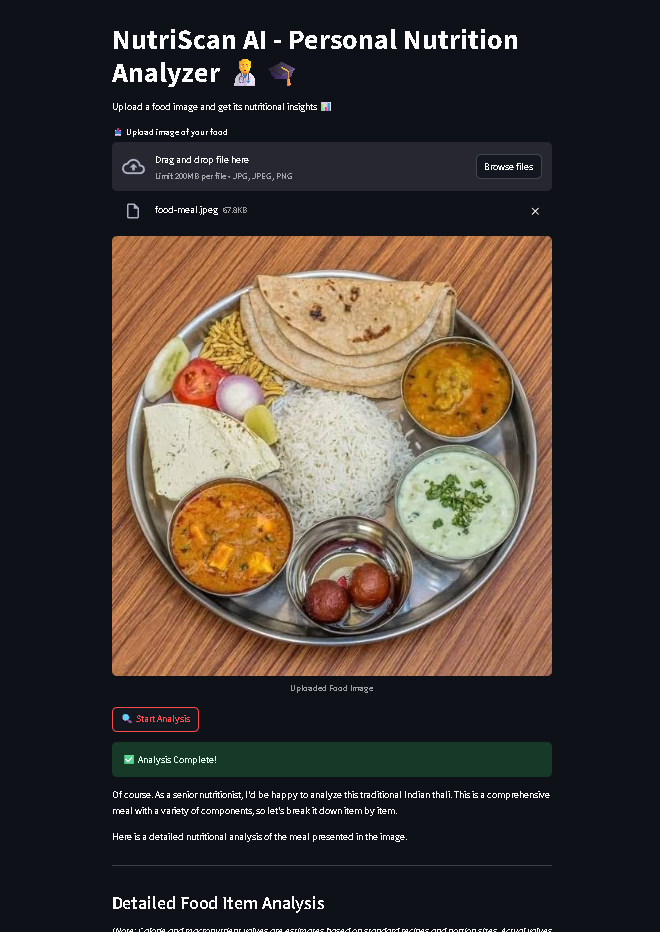

# NutriScan AI

This is a **Streamlit Web Application** that uses **Google's Vision Pro model: Gemini-2.5-pro** to analyze food images and provide a detailed nutritional breakdown and health benefits. It's like having your personal virtual nutritionist expert at your hands all time! 😃

## ⚡ Features  :

* Upload a photo of your meal/food.
* Get :-

  * Food item names
  * Estimated calories
  * Macronutrient breakdown (carbs, protein, fat)
  * Health rating (Healthy / Unhealthy / Moderate)
  * Health suggestions and alternatives
* Overall summary : Whether it is a part of healthy diet.
* Fast, Efficient and User Friendly!

## 🛠️ Installation :

1. **Clone the Repository**

   ```bash
   git clone https://github.com/SubinoyBera/NutriScan-AI.git
   cd NutriScan-AI
   ```

2. **Create and Activate Virtual Environment (Optional but Recommended)**

   ```bash
   conda create -p venv python==3.11.5 -y
   ```

3. **Install Required Packages**

   ```bash
   pip install -r requirements.txt
   ```

4. **Set Up `.env` File**
   Create a file named `.env` in the root directory and add your Gemini API key:

   ```bash
   GOOGLE_API_KEY = your_google_gemini_api_key
   ```

## 🚀 Run App :

```bash
streamlit run app.py
```

Then open the local URL shown in your terminal (usually `http://localhost:8501`) in a browser.

## 💡 Get Started :

1. Upload an image of your meal.
2. Click on "Start Analysis".
3. Get a detailed nutrition report with calorie count, macronutrients, health rating, and much more! <br>
<br>
<center> APPLICATION IMAGE


</center>

<br>

<b>🙏 🎗️ THANK YOU !! :) <br>
*- with regards : Subinoy Bera (developer)* </b><br>
🧡🤍💚
